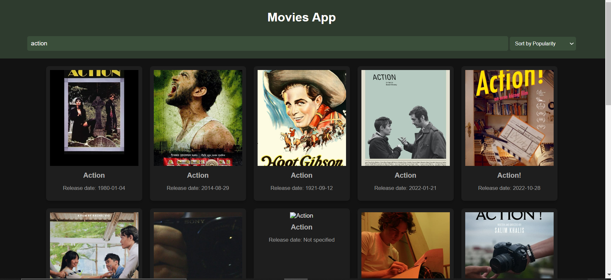
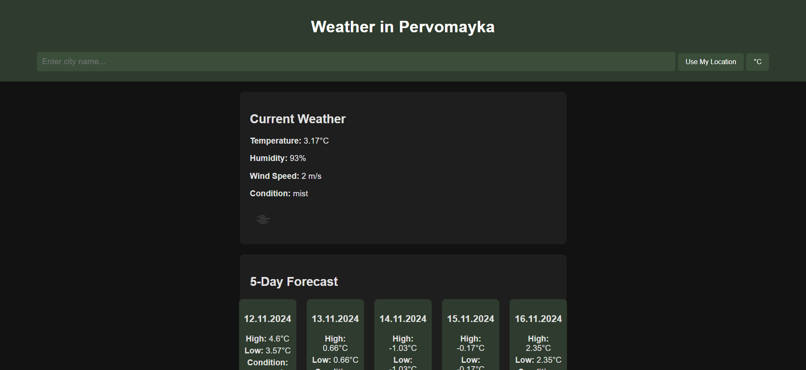
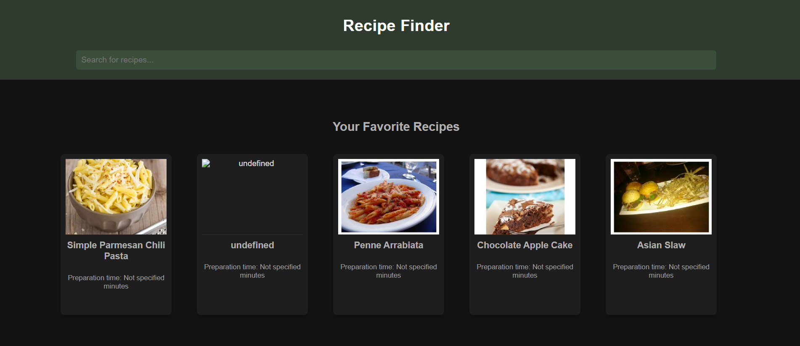

1)Applications Overview
________________________________________________________________
1. Movies App
The Movies App allows users to search for movies by title, filter the results by popularity, release date, or rating, and add movies to their watchlist. Each movie poster is clickable and displays more details in a modal window.

Features:

Search for movies by title.
Sort movies by popularity, release date, or rating.
Add movies to your watchlist.
View detailed information about each movie in a modal window.

2. Recipe Finder
The Recipe Finder helps users search for recipes based on ingredients or recipe names. Users can view detailed information about each recipe and save their favorite recipes for quick access.

Features:

Search for recipes by name or ingredient.
View recipe details in a modal window.
Save recipes to a favorites section for future reference.

3. Weather App
The Weather App provides current weather information for any city, including a 5-day weather forecast. It also supports location-based weather data using the user's geolocation and allows users to toggle between Celsius and Fahrenheit units.

Features:

Search for the weather of any city.
View current weather and 5-day forecast.
Toggle between Celsius and Fahrenheit.
Use your current location for weather data

________________________________________________________________________________________

2)How to Run the Applications
1.Clone the repository:
Open your terminal and run:
git clone https://github.com/your-username/your-repo.git

2.Navigate to the project directory and install any necessary dependencies (if using any specific libraries like JavaScript frameworks):
cd your-repo
npm install

3.Open the Applications:

Simply open the HTML files in a web browser to view the apps:
Movies App - Open movies.html
Recipe Finder - Open recipe.html
Weather App - Open weather.html

4.Live Preview (Optional):

You can use a local server to view the apps if you're using any server-side functionality or prefer not to open HTML files directly.
Using Live Server extension in VSCode or http-server can help in this case.

__________________________________________________________________________________________

3)Screenshots:
1.
2.
3.

__________________________________________________________________________________________

4)Technologies Used
HTML: Structure and layout of the applications.
CSS: Styling and design.
JavaScript: Dynamic functionality for searching, sorting, and displaying data.
API Integration: External APIs may be used for fetching movie, recipe, and weather data (you can specify API keys in the respective script files if needed).

__________________________________________________________________________________________

